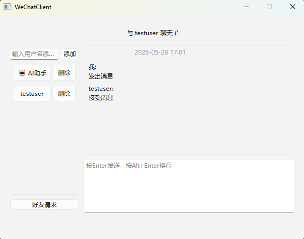
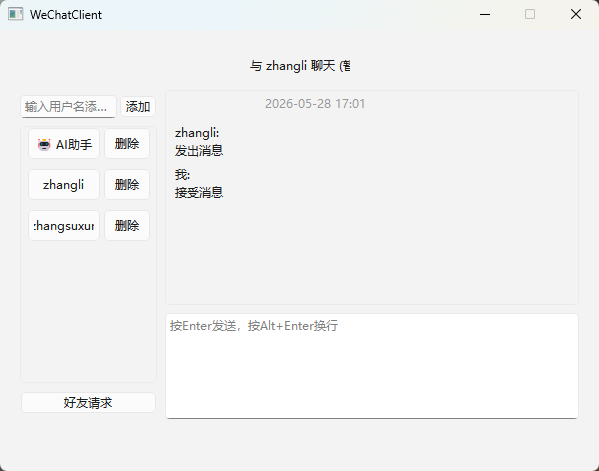
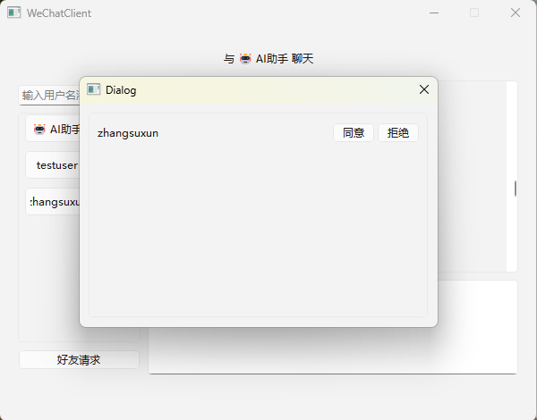
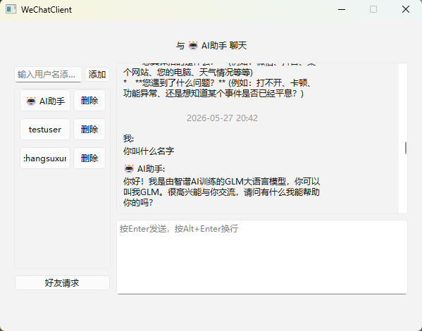

# Qt IM Client

基于 Qt 6 + C++ 开发的跨平台即时通讯客户端，采用 HTTP + WebSocket 双协议架构，实现实时聊天、离线消息、AI 助手等核心功能。服务端基于 Python Tornado 构建，支持 WebSocket 长连接与 REST API。

------

## 🖼️ 项目展示

### 登录页面

   

### 聊天界面

### 好友列表

### AI 聊天

------

## ✨ 核心功能

| 功能模块     | 功能描述                             |
| ------------ | ------------------------------------ |
| **登录注册** | 用户账号注册与登录认证               |
| **好友管理** | 好友列表展示、添加好友、好友请求处理 |
| **实时聊天** | WebSocket 实时消息收发               |
| **离线消息** | 用户离线时消息暂存，上线后自动推送   |
| **历史消息** | 基于时间戳的分页加载，支持无限滚动   |
| **AI 助手**  | 集成智谱 GLM-4 API，实现智能聊天     |
| **本地缓存** | SQLite 消息持久化，支持离线查看      |

------

## 🛠️ 技术栈

### 客户端

| 技术          | 版本  | 用途             |
| ------------- | ----- | ---------------- |
| Qt            | 6.x   | UI 框架          |
| Qt Network    | -     | HTTP 请求        |
| Qt WebSockets | -     | WebSocket 长连接 |
| Qt SQL        | -     | SQLite 数据库    |
| SQLite        | -     | 本地消息缓存     |
| C++           | 11/14 | 核心逻辑         |

### 服务端

| 技术       | 版本 | 用途       |
| ---------- | ---- | ---------- |
| Python     | 3.8+ | 服务端开发 |
| Tornado    | 6.x  | Web 框架   |
| MySQL      | 8.0+ | 数据存储   |
| 智谱 GLM-4 | -    | AI 对话    |

------

## 🏗️ 项目架构

### 架构设计

### 核心模块职责

#### ApiManager（网络层）

- **HTTP 请求封装**：基于 QNetworkAccessManager 实现 REST API 调用
- **WebSocket 管理**：长连接建立、心跳保活、断线重连
- **消息队列**：待确认消息队列与 ACK 重试机制
- **信号槽解耦**：通过信号分发网络事件，实现网络层与 UI 解耦

#### ChatPanel（业务层）

- **消息展示**：消息列表管理、时间标签自动插入
- **滚动加载**：检测滚动条位置触发历史消息加载
- **状态管理**：当前好友、已加载消息、最后消息时间

#### DBManager（数据层）

- **SQLite 操作**：消息增删查改封装
- **增量同步**：基于时间戳的消息同步策略

------

## 💡 核心技术亮点

### 1. WebSocket 长连接管理

- **心跳保活**：30s 定时发送心跳包，60s 超时判定断开
- **断线重连**：5s 重试间隔，最多重试 5 次
- **状态同步**：通过标志位统一管理连接状态

### 2. 消息可靠性保障

- **ACK 确认机制**：发送消息加入待确认队列，收到 ACK 后移除
- **超时重试**：5s 超时自动重试，最多重试 3 次
- **消息去重**：客户端生成唯一 clientMsgId，服务端缓存已处理消息

### 3. 本地缓存与增量同步

- **SQLite 持久化**：聊天记录本地存储，支持离线查看
- **增量拉取**：切换好友时优先加载本地缓存，仅拉取更新消息
- **无限滚动**：滚动到顶部自动触发历史消息加载

### 4. Qt 信号槽解耦设计

- **异步事件驱动**：网络响应通过信号触发 UI 更新
- **模块解耦**：ApiManager 只负责网络请求，不关心 UI 实现
- **自定义控件**：FriendButton、MessageItem 通过信号暴露交互事件

### 5. AI 助手集成

- **消息路由**：根据 to_user_id 判断是否为 AI 消息
- **异步回调**：AI 回复通过事件循环异步推送，不阻塞主线程
- **统一处理**：AI 回复复用普通消息处理逻辑

------

## ⚡ 项目难点与解决方案

| 难点                     | 解决方案                                         |
| ------------------------ | ------------------------------------------------ |
| **WebSocket 连接稳定性** | 心跳保活 + 断线自动重连，最大重试次数限制        |
| **QObject 生命周期管理** | 使用 Qt 对象树机制，父对象析构时自动删除子对象   |
| **JSON 序列化**          | 使用 Qt 内置 QJsonDocument 处理，统一数据格式    |
| **消息可靠性**           | ACK 确认 + 超时重试 + 消息去重机制               |
| **MySQL 阻塞查询**       | 使用线程池异步执行数据库操作，避免阻塞主事件循环 |

------

## 🚀 运行方式

### 环境要求

- Qt 6.2+（需包含 QtNetwork、QtWebSockets 模块）
- Python 3.8+
- MySQL 8.0+

### 服务端运行

### 客户端运行

1. 使用 Qt Creator 打开 client/WeChatClient.pro
2. 配置 Qt 6 构建套件
3. 编译并运行

### 数据库初始化

1. 创建 MySQL 数据库 im_db
2. 修改 server/config.py 中的数据库连接配置
3. 启动服务端自动创建表结构

------

## 📝 项目总结

### Qt/C++ 能力体现

- **Qt 框架熟练使用**：Qt Network、Qt WebSockets、Qt SQL 等模块
- **信号槽机制**：异步事件驱动、模块解耦
- **自定义控件开发**：FriendButton、MessageItem 组件封装
- **内存管理**：Qt 对象树机制、智能指针使用

### 工程能力亮点

- **架构设计**：分层架构、模块化设计
- **网络编程**：HTTP + WebSocket 双协议、长连接管理
- **数据持久化**：SQLite 本地缓存、增量同步策略
- **可靠性保障**：消息 ACK、超时重试、断线重连
- **全栈开发**：Qt 客户端 + Python Tornado 服务端